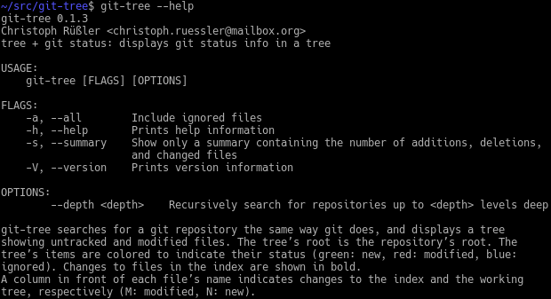

# git-tree



git-tree is a small command line utility for showing the status of untracked
and modified files in a git repository as a tree.

## Installation

Provided you have `cargo` installed, installation is as easy as

```
cargo install --git https://github.com/cruessler/git-tree
```

This will download the source code and compile the binary which can then be
found in `~/.cargo/bin`. If that’s in your `$PATH`, you can type `git-tree
--help` to get an overview of the available commands.
